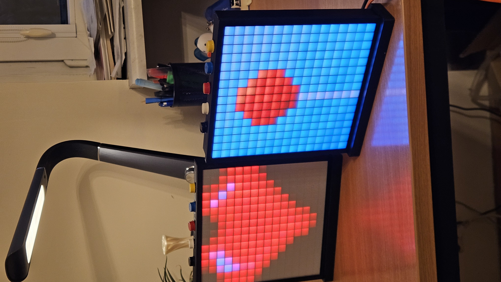
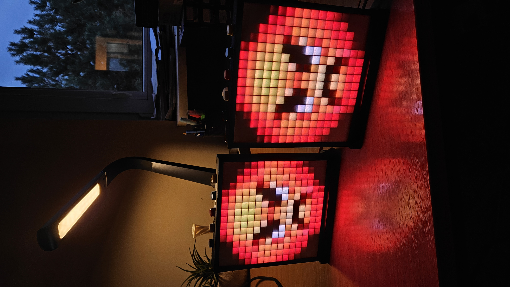
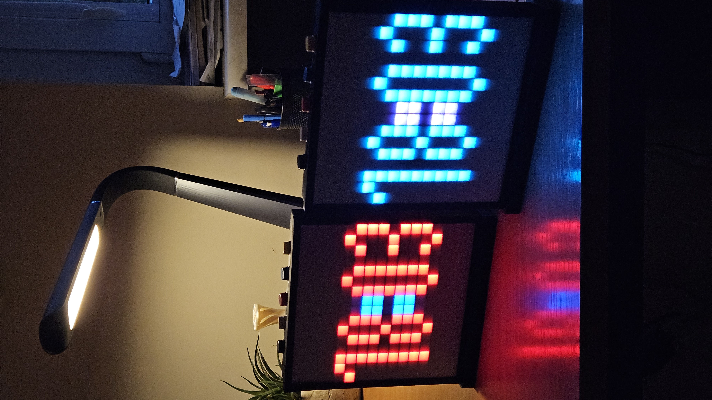
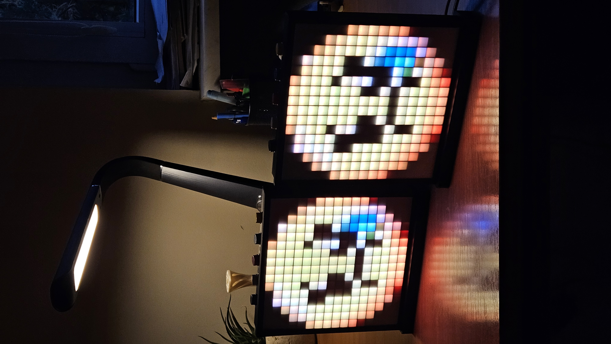
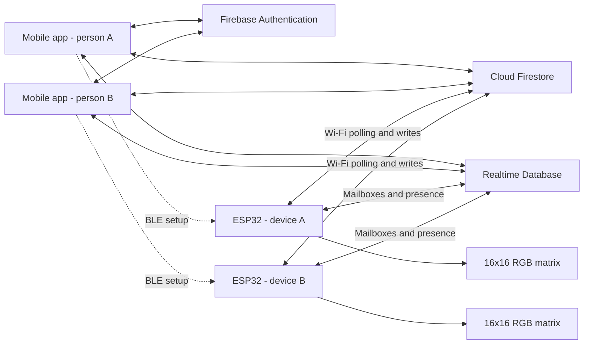

# TwinGlow

**A little light for your desk. A small connection to someone else.**

TwinGlow is a connected **16×16 RGB LED display** for pixel art, animations, and everyday information. Use one as your own personal display, or pair two TwinGlows to share visual content with another person.

<p align="center">
  
</p>

<p align="center">
  <a href="#features">Features</a> ·
  <a href="#sharing-the-light">Sharing</a> ·
  <a href="twin_glow/README.md">Mobile app</a> ·
  <a href="TwinGlow/README.md">Device firmware</a> ·
  <a href="#getting-started">Getting started</a>
</p>

## What is TwinGlow?

Some messages work better as a picture: a heart, a familiar character, or a few frames of animation. TwinGlow gives those small expressions a place outside your phone, on a physical pixel display.

Each device combines an ESP32 microcontroller, a 256-pixel RGB matrix, and five physical buttons. The companion mobile app lets you create content, arrange screens, and configure the display. Firebase connects the app and devices over the internet.

Pairing is optional. A single TwinGlow can be a desktop clock, a little pixel-art gallery, or an animation display. Connecting it to someone else's TwinGlow adds shared screens and device-to-device visual messages.

## Features

### ✅ Implemented in the repository

| Feature | What you can do |
| --- | --- |
| **16×16 RGB display** | Show custom images and looping animations on 256 individually addressed pixels. |
| **Pixel-art tools** | Draw images and animation frames, choose colors, fill areas, mirror artwork, and manage names and tags. |
| **Image and animation import** | Crop and convert images, GIFs, animated WebP, and APNG content to 16×16 assets before editing and saving. |
| **Digital clock** | Configure digit, colon, and background colors and an optional seconds bar; firmware also supports 12/24-hour rendering. |
| **Screen playlist** | Create, edit, delete, reorder, and enable or disable screens. Image and animation screens can hold an asset pool with a chosen default. |
| **Display settings** | Rename devices, select a timezone, adjust brightness, and configure a daily sleep window with dimming or a blank panel. |
| **Asset library** | Manage your own images and animations and browse default assets stored in Firestore. |
| **Pairing and sharing** | Invite another account by email, select one device per person, edit shared image/animation screens, and send the currently selected content using a physical button. |
| **Physical controls** | Navigate screens, adjust brightness, cycle assets, dismiss received content, and reset Wi-Fi provisioning. |
| **Connectivity and local playback** | Set up Wi-Fi over BLE, synchronize through Firebase, and keep already-loaded content running during a network interruption, subject to the limits below. |

Animations use **2–16 frames**, with **50–5,000 ms per frame**, and a packed-content size limit. Shared screens support **1–10 matching assets**. Screens change with the previous/next buttons by default; automatic playlist rotation exists in the firmware but is disabled in the supplied configuration.

### 🚧 In development / future

- **Sensor information:** the app has a sensor-screen editor, and firmware includes BME680 detection, readings, rendering, and telemetry. Treat this as an in-development category rather than a finished external-sensor experience.
- **Games and additional screen types:** game model/preview placeholders exist; playable games are not implemented.
- **App finishing work:** password recovery, profile-name persistence, and the device-removal UI remain unfinished.

The project is under active development. “Implemented” describes code present here; it does not imply that every path has been verified on two physical devices. The [sharing implementation notes](docs/shared_screens_implementation.md) distinguish software checks from remaining hardware validation.

## Sharing the light

Imagine you have a TwinGlow on your desk and someone you care about has another. You each sign into the app, choose a device, and connect your accounts through an email invitation. The recipient accepts with their own device. The current model supports **one active pair per account**, with one selected device on each side.

There are two ways to share:

1. **A shared screen.** Share an image or animation screen from the app. Once both accounts have opened the updated app and established sharing consent, the same screen appears in both ordinary playlists. Either person can edit its name, default asset, asset pool, and shared artwork. Each person keeps their own screen order and enabled state. Publishing a screen does not force the other device to switch away from its current screen.
2. **A visual message from the device.** On a share-enabled image or animation screen, hold **ACTION for about 2.5 seconds** to capture and send the selected cached asset. The other device fetches the image or complete animation and holds it on the display until dismissed, replaced by another received message, or the pairing changes. A short ACTION press or previous/next returns to the playlist.

Device delivery is **polling-based**: incoming pairing state is checked about every five seconds, while Firestore configuration and shared-content revisions have a 60-second fallback poll. RTDB revision changes can request an earlier configuration check. Network work, downloads, retries, and sleep can add delay; delivery is not instantaneous or frame-synchronized.

Snapshot delivery uses a latest-message mailbox rather than a message history. New messages can replace older ones before they are displayed. Events older than 24 hours are rejected, and blank-panel sleep defers receipt. The receiver records handled sequences and publishes a display acknowledgment after rendering.

Stopping sharing restores a private screen for its creator and removes the partner's reference. Unpairing also revokes shared access and clears delivery state. An offline device learns about the change when it reconnects.

## Standalone mode

You do not need a partner to use TwinGlow. Make your own pixel art, build a small animation library, add a clock, and arrange a personal screen playlist. Brightness, sleep schedules, timezone settings, and asset pools all work independently of account pairing. Sensor information is a future extension of this experience.

**Standalone does not mean fully offline.** Initial setup, cloud content downloads, app changes, and sharing require connectivity. Once loaded, the device renders its playlist locally and responds to its buttons without an open app. Wi-Fi credentials, brightness, timezone, sleep settings, and delivery counters persist in NVS; the playlist and pixel assets are held in RAM. Playback after an offline cold boot is therefore not guaranteed, and recovery logic may restart the device during a prolonged outage. Clock and sleep behavior also require a valid system time.

## Mobile app

The companion app is built with **Flutter and Dart**, with Android and iOS projects in this repository.

<table>
  <tr>
    <td align="center"><br /><sub>Screen playlist</sub></td>
    <td align="center"><br /><sub>Asset library</sub></td>
    <td align="center"><br /><sub>Device configuration</sub></td>
    <td align="center"><br /><sub>Settings and pairing</sub></td>
  </tr>
</table>

Use the app to manage screens and assets, draw or import artwork, edit animation frames, configure devices, and manage pairing invitations. Screen previews let you inspect content before it reaches the matrix. The screenshots above were captured in the iPhone simulator.

[Mobile application documentation](twin_glow/README.md)

## Physical device

<p align="center">
  
  
  
</p>

The photographed devices are small framed pixel displays with a five-button interface. Firmware targets the **ESP32 Arduino platform** and a **16×16 NeoPixel/WS2812-compatible RGB matrix**, using GRB data at 800 kHz and serpentine pixel mapping. Wi-Fi carries cloud traffic; BLE is used for provisioning.

The firmware documents GPIO assignments and an optional BME680 connection. The repository does not include a complete hardware bill of materials, enclosure fabrication files, or a verified power-supply specification. Exact board, panel, and power choices must be checked against the physical build.

[Device and firmware documentation](TwinGlow/README.md)

## Architecture



| Layer | Responsibility |
| --- | --- |
| **Flutter app** | Email/password login, BLE setup, editors, playlists, settings, invitations, and shared-content transactions. |
| **Firebase Auth** | Human accounts and individually enrolled device accounts. |
| **Cloud Firestore** | Device settings, private playlists, canonical image/animation assets, shared screen definitions, and bilateral sharing consent. |
| **Realtime Database** | Pair invitations and membership, device presence, revision hints, snapshot mailboxes, acknowledgments, and sensor telemetry scaffolding. |
| **ESP32 firmware** | Polling and downloads, RAM caching, local rendering, time synchronization, sleep scheduling, and buttons. Runtime cloud operations are serialized on a FreeRTOS worker. |

The app talks directly to Firebase using client SDKs. Firmware uses FirebaseClient and HTTPS. Firebase rules enforce access, while administrative scripts enroll device identities. There is **no Cloud Functions codebase or Firebase Storage asset pipeline** in the current repository: pixel content is stored in Firestore, and sent snapshots travel through RTDB.

## Repository guide

```text
TwinGlow/
├── README.md                 # Project overview
├── twin_glow/                # Flutter mobile application
│   └── README.md             # App setup and development
├── TwinGlow/                 # ESP32 Arduino firmware (flat sketch directory)
│   └── README.md             # Hardware, enrollment, build, and runtime
├── firebase/                 # Rules, emulator tests, enrollment, and migration tools
├── docs/                     # Design notes and implementation records
├── readme_img/               # Real device photos, app screenshots, and video
├── tests/fixtures/           # Shared screen and pairing payload fixtures
└── tools/                    # SDK patches, native tests, and data utilities
```

## Getting started

For a development setup, you need the Flutter toolchain, ESP32 Arduino tools and libraries, and a Firebase project with Email/Password Authentication, Firestore, and Realtime Database.

1. Follow the [mobile app setup](twin_glow/README.md#development-setup) to generate your own Firebase configuration and run the app.
2. Follow the [device setup](TwinGlow/README.md#setup-and-enrollment) to match the wiring, enroll each device for its owner, and install its private credentials.
3. Configure the Firebase rules from [`firebase/`](firebase/) for your project. The app's `firebase.json` contains FlutterFire app metadata; the backend rules live in `firebase/firebase.json`.
4. Flash the firmware, provision Wi-Fi from **Settings → Add New Device**, and create your first screen. A second device is only needed for sharing.

Project configuration and private device credentials are supplied separately; a fresh clone is not a preconfigured demo. Default assets are queried from your Firestore database, and no default-content seeding script is provided.

## Development and verification

The repository includes Flutter unit/widget tests, Firebase emulator authorization/integration tests, and native C++ sanitizer checks. Commands and prerequisites are documented in the [app](twin_glow/README.md#verification) and [firmware](TwinGlow/README.md#verification) READMEs.

For deeper implementation context, see [pairing and snapshot delivery](docs/pairing_implementation.md), [shared screens v2](docs/shared_screens_implementation.md), and the [FirebaseClient patches](tools/firebaseclient-patch/README.md). Older files in `docs/` include historical designs, obsolete authentication instructions, and earlier sharing schemas; use these READMEs and current source for setup and behavior.

When contributing, describe whether a change affects standalone use, sharing, or both, and include the relevant software checks and any physical-device observations. Photos and successful builds alone do not establish end-to-end delivery or sensor validation.
